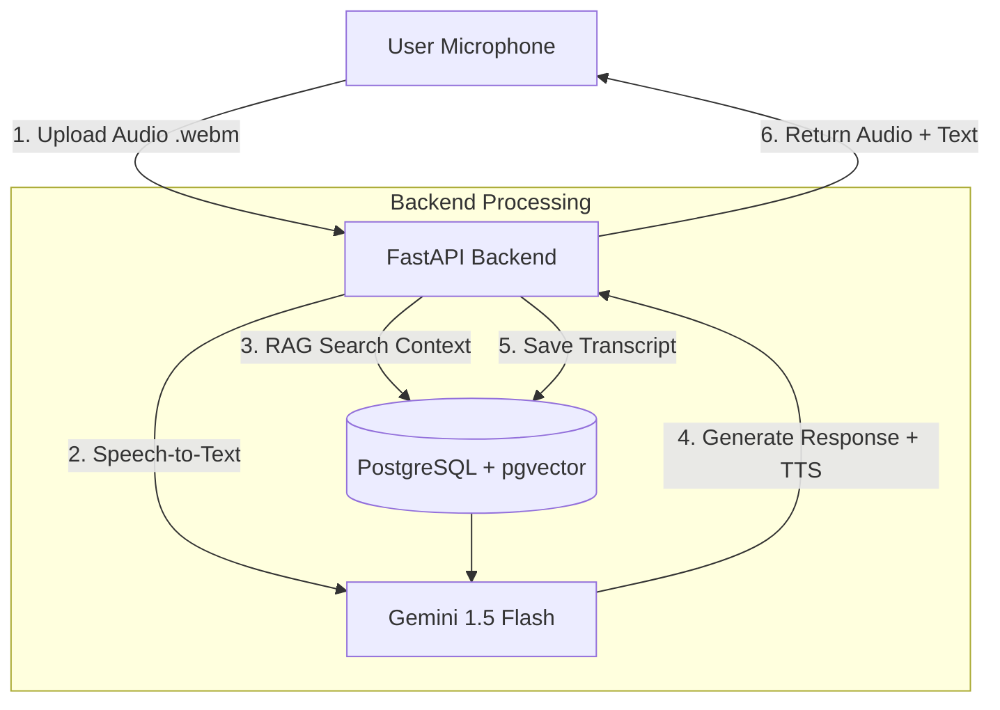

# 🗣️ Talki - Nền tảng Luyện Phản xạ & Tự tin Giao tiếp (AI Mentor)

> **Dự án Khởi nghiệp / Đồ án Tốt nghiệp**
>
> _Nền tảng giả lập môi trường giao tiếp áp lực cao (Phỏng vấn, Thuyết trình) giúp người Việt xóa bỏ sự rụt rè và thói quen "ậm ừ"._

---

## 📖 1. Tổng quan (Overview)

**Talki** không dạy ngữ pháp Tiếng Việt. Chúng tôi tập trung giải quyết vấn đề **Tâm lý & Kỹ năng mềm** của Gen Z khi bước vào môi trường chuyên nghiệp.

Người dùng sẽ trải qua lộ trình: **Học lý thuyết (Video) → Mở khóa màn thực hành → Đối đầu với AI Mentor (Boss Fight)**.

### 🎯 Điểm khác biệt (USP)

- **Môi trường giả lập 100% Tiếng Việt:** Luyện tập phỏng vấn xin việc, báo cáo với sếp, xử lý khủng hoảng truyền thông.
- **Cơ chế "Boss Fight":** AI đóng vai nhân vật khó tính (HR VinGroup, Sếp khó chiều...) để tạo áp lực thực tế.
- **Feedback sâu:** Không chỉ chấm đúng sai, AI phân tích độ trôi chảy (đếm số từ thừa "à, ờ"), độ tự tin và tư duy trả lời.

---

## 🏗️ 2. Kiến trúc Hệ thống (Tech Stack)

Dự án sử dụng kiến trúc hiện đại, tối ưu chi phí và dễ mở rộng.

| Thành phần    | Công nghệ            | Chi tiết                                     |
| :------------ | :------------------- | :------------------------------------------- |
| **Frontend**  | **ReactJS** (Vite)   | Giao diện SPA, xử lý ghi âm (Web Audio API). |
| **Backend**   | **Python FastAPI**   | Xử lý Logic bất đồng bộ (Async), API nhanh.  |
| **Database**  | **PostgreSQL**       | Lưu User, Lộ trình học, Tiến độ mở khóa.     |
| **Vector DB** | **pgvector**         | Hỗ trợ RAG tìm kiếm kiến thức chuyên ngành.  |
| **AI Core**   | **Gemini 1.5 Flash** | Xử lý đa phương thức (Audio/Text), Roleplay. |
| **Storage**   | **Local / MinIO**    | Lưu tạm file ghi âm trong 3 ngày tự hủy.     |

### 🧩 Luồng xử lý dữ liệu (Data Flow)



---

## 💡 3. Tính năng Chính (Key Features)

### 📚 Phân hệ 1: Lộ trình & Mở khóa (Unlock Progression)

- **Cấu trúc:** Level (Cấp độ) → Chapter (Chương) → Lesson (Bài học).
- **Logic mở khóa:** User bắt buộc phải xem hết các Video lý thuyết trong Chapter mới được mở khóa màn **Boss Fight**.
- **Mục đích:** Đảm bảo user có kiến thức nền ("Load đạn") trước khi vào thực chiến.

### 🥊 Phân hệ 2: Boss Fight (AI Roleplay)

- **AI Persona:** AI nhập vai triệt để (Ví dụ: HR hỏi dồn, áp đặt tình huống khó).
- **Turn-based:** Hội thoại luân phiên (User nói ↔ AI phản hồi).
- **Feedback cuối trận:** AI trả về Scorecard sau khi kết thúc:
  - _Độ trôi chảy:_ Đếm lỗi "à, ờ, thì là...".
  - _Nội dung:_ Độ bám sát chủ đề.
  - _Tư duy:_ Lời khuyên cải thiện kỹ năng.

### 🎮 Phân hệ 3: Gamification

- **Hearts (Tim):** Giới hạn số lượt đánh Boss (User Free: 3 tim/ngày).
- **My Mistakes:** Sổ tay tự động ghi lại các lỗi sai lặp lại nhiều lần.

---

## 🛠️ 4. Cài đặt & Triển khai (Installation)

### Yêu cầu hệ thống

- Python 3.10+
- Node.js 18+
- Docker & Docker Compose

### Bước 1: Khởi chạy Database

```bash
# Tại thư mục gốc
docker-compose up -d
```

### Bước 2: Setup Backend (Python)

```bash
cd app
# Tạo môi trường ảo
python -m venv venv

# Kích hoạt môi trường (Windows)
venv\Scripts\activate
# Kích hoạt môi trường (Mac/Linux)
# source venv/bin/activate

# Cài đặt thư viện
pip install -r requirements.txt

# Cấu hình env
cp .env.example .env

# Chạy Server
uvicorn app.main:app --reload
```

### Bước 3: Setup Frontend (React)

```bash
cd frontend
npm install
npm run dev
```

---

## 🗄️ 5. Cấu trúc Database (Dự kiến)

### 5.1. Bảng User & Progress

- **users**: `id`, `email`, `password_hash`, `full_name`, `heart_count`, `last_heart_refill`.
- **user_progress**: `user_id`, `lesson_id`, `status` (`COMPLETED`, `LOCKED`).

### 5.2. Bảng Content

- **chapters**: `id`, `title`, `description`, `level`.
- **lessons**: `id`, `chapter_id`, `type` (`VIDEO`, `BOSS_FIGHT`), `content_url`.

### 5.3. Bảng Conversation

- **conversations**: `id`, `user_id`, `lesson_id`, `final_score`, `start_time`, `end_time`.
- **messages**: `id`, `role` (`user`, `assistant`), `audio_url`, `transcript`, `feedback`.

---

## 🗺️ 6. API Endpoints Chính (v1)

| Phân nhóm    | Method | Endpoint                              | Mô tả                           |
| :----------- | :----- | :------------------------------------ | :------------------------------ |
| **Auth**     | `POST` | `/api/v1/auth/login`                  | Đăng nhập & lấy Access Token.   |
| **Battle**   | `POST` | `/api/v1/conversations/start`         | Bắt đầu Boss Fight (Check tim). |
| **Battle**   | `POST` | `/api/v1/conversations/{id}/speak`    | Gửi Audio & nhận phản hồi AI.   |
| **Report**   | `GET`  | `/api/v1/conversations/{id}/feedback` | Lấy Scorecard tổng kết.         |
| **Progress** | `POST` | `/api/v1/progress/complete-video`     | Đánh dấu hoàn thành video.      |
| **Profile**  | `GET`  | `/api/v1/progress/my-mistakes`        | Xem tổng hợp lỗi sai.           |
